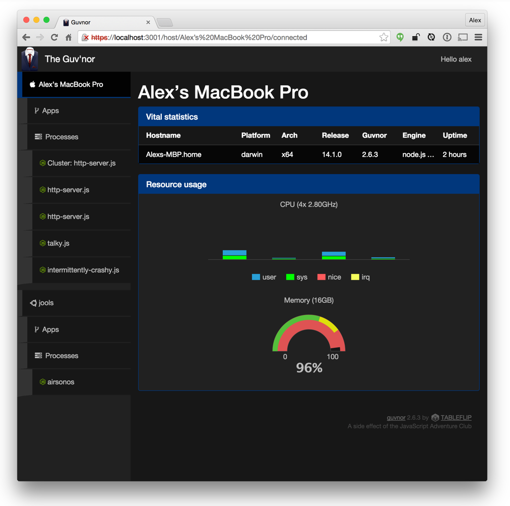

# The Guv'nor

[](https://gitter.im/tableflip/boss/discuss) [](https://waffle.io/tableflip/boss) [](https://travis-ci.org/tableflip/boss) [](https://david-dm.org/tableflip/boss) [](https://coveralls.io/r/tableflip/boss)

A node process manager that isn't spanners all the way down.

## Features

* Monitoring via console or web
* Configure user/group to run processes as
* Auto process restart on crash
* Log redirection to per process out/err files
* Cluster support
* Monitor process CPU/memory/event loop latency
* Remotely trigger GC/heap dump
* Debug remote processes
* Store exception stack traces and logs for post-crash analysis

## Command line interface


## Web interface

Start the web interface with (can be run without boss running in the background - for example
if you want to monitor one or more boss servers from a different machine that is not running boss):

```sh
$ guv-web
```

or run the web interface under boss itself (please read the [guvnor web setup](./docs/web.md#prerequisites) section first!):

```sh
$ guv web
```



## Install

```sh
npm install -g process-boss
```

## Upgrading

npm's upgrade command is [a big angry box of wasps](https://github.com/npm/npm/issues/6247#issuecomment-63022163) so to be sure, kill boss, remove it, reinstall and start it.

```sh
guv kill
npm remove -g process-boss
npm install -g process-boss
guv
```

## Usage

Comprehensive help is available on the command line:

```sh
guv --help
```

and with more detail for each subcommand, e.g.:

```
guv start --help
```

The first time you invoke a boss command, the daemon will start in the background.  Because boss can run processes as different users, it needs to be able to switch to those users.  Consequently you should start boss as root or another privileged user.

## Help

1. [Starting and stopping processes](docs/processes.md)
1. [Controlling the Daemon](docs/daemon.md)
1. [Managing clusters](docs/clusters.md)
1. [Installing and running apps](docs/apps.md)
1. [Remote access and monitoring (e.g. boss-web)](docs/remote.md)
1. [Web interface](docs/web.md)
1. [Web interface - configuration](docs/web-config.md)
1. [Web interface - user management](docs/web-uesrs.md)
1. [Programmatic access](docs/programmatic-access.md)
1. [Programmatic access - local](docs/programmatic-access-local.md)
1. [Programmatic access - remote](docs/programmatic-access-remote.md)
1. [Programmatic access - events](docs/programmatic-access-events.md)

Configure
---

A configuration file if run as root can be placed at `/etc/boss/bossrc`. Take a look at the [default configuration file](bossrc) for details.

If you create a configuration file, it will be merged with the default configuration, so if you only want to override one property, you need only specify one property in your config file.

## Starting boss on boot

Boss comes with a sysv init script.  To configure it to run on system boot run the following:

```sh
$ sudo ln -s /usr/local/lib/node_modules/process-boss/scripts/init/sysv/boss /etc/init.d/boss
$ sudo update-rc.d boss defaults
```

To undo this, run:

```sh
$ sudo update-rc.d boss remove
$ sudo rm /etc/init.d/boss
```

## apt-get

If you installed node via `apt-get install nodejs`, you should create a symlink to the `nodejs` binary:

```sh
$ sudo ln -s /usr/bin/nodejs /usr/bin/node
```

Also, the init script is probably stored at `/usr/lib/node_modules/...` instead of `/usr/local/lib/node_modules/...` - please check your filesystem to be sure.

## Development

### Vagrant setup

It's useful to be able to set up and tear down fresh VMs to do testing, so a Vagrant file is available. It's configured to run Debian 7.7 and install the latest versions of Node and Boss.

Once Vagrant is installed, cd into the vagrant directory and run:

```sh
$ vagrant up
$ vagrant ssh
$ sudo npm install -g process-boss
```

Then when you are done, to shut the machine down exit your SSH session and run:

```sh
$ vagrant destroy
```

## Changelog

See the [changelog](CHANGELOG.md)