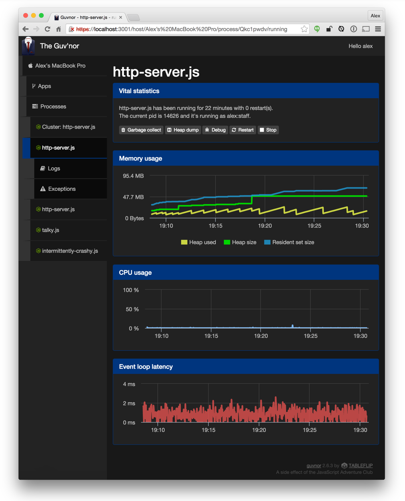
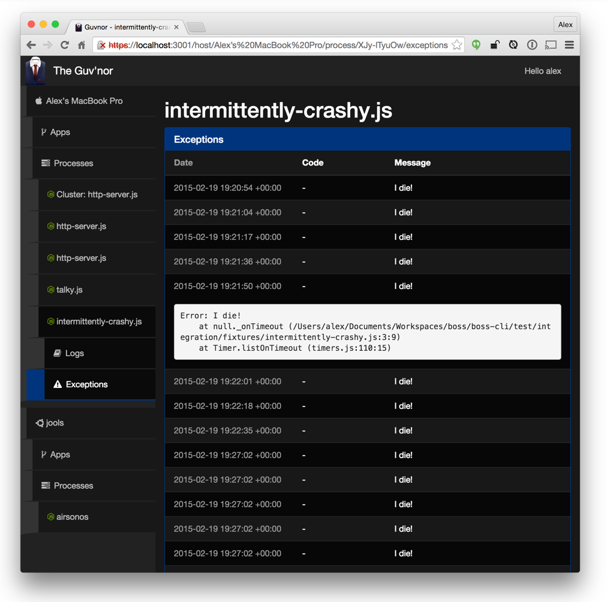
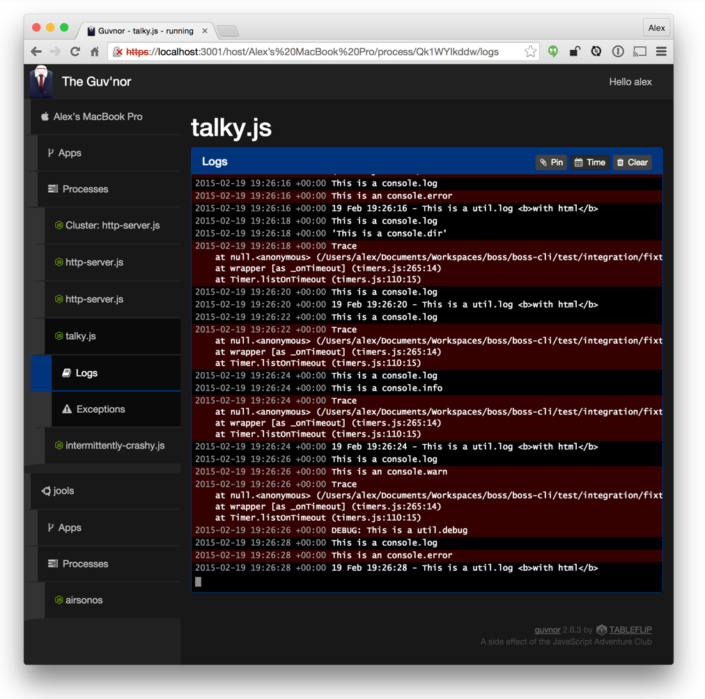

# Help

1. [Starting and stopping processes](processes.md)
1. [Controlling the Daemon](daemon.md)
1. [Managing clusters](clusters.md)
1. [Installing and running apps](apps.md)
1. [Remote access and monitoring (e.g. guv-web)](remote.md)
1. Web interface
1. [Web interface - configuration](web-config.md)
1. [Web interface - user management](web-users.md)
1. [Programmatic access](programmatic-access.md)
1. [Programmatic access - local](programmatic-access-local.md)
1. [Programmatic access - remote](programmatic-access-remote.md)
1. [Programmatic access - events](programmatic-access-events.md)

## guvnor-web

A web interface for the [guvnor](http://github.com/tableflip/guvnor) node.js process manager.

Memory usage and per-core CPU load:


Process usage graphs including heap size, resident set size, CPU, event loop latency, etc.



See stack traces for the uncaught exceptions that took your app down



Live logs for your process



### Prerequisites

 1. Guvnor installed on one or more servers
 2. A modern web browser

### Setup

Here `$CONFIG_DIR` is `/etc/guvnor` if you are root or `$HOME/.config/guvnor` if you are not.  

Unless you want it to listen on privileged ports (e.g. 80 or 443), you do not need to be root to run guvnor-web.

It's generally advised to not run processes as root unless you absolutley have to, so please consider running guvnor-web as a non-priveleged user.

#### Step 1. Create a user to log in as

```sh
$ guv-web useradd alex
```

#### Step 2. On the machine Guvnor is running on, obtain the host config

```sh
$ sudo guv remoteconfig

Add the following to your guvnor-web-hosts file:

[foo-bar-com]
  host = foo.bar.com
  port = 57483
  user = root
  secret = ZD57XFx6sBz....
```

Create a file named `$CONFIG_DIR/guvnor-web-hosts` with the output from the `remoteconfig` command.

#### Step 3. Still on the Guvnor machine, add a remote user

```sh
$ sudo guv useradd alex

[alex.foo-bar-com]
  secret = LsYd5UaH...
```

The file `$CONFIG_DIR/guvnor-web-users` should have been created during step 1 - open it and add the output from `useradd`.

#### Step 3a.  Optionally override which user you connect as

If you wish to log in to guvnor-web as `alex`, but need to administer a process running on a remote host as `alan`, you can override the user you connect to a given server in `$CONFIG_DIR/guvnor-web-users`:

```sh
[alex.foo-bar-com]
  user = alan
  secret = LsYd5UaH...
```

#### Step 4. Start guvnor-web

```sh
$ guv-web
```

### Running guvnor-web with guvnor

Ouroboros style:

```sh
$ guv web
```

### Every time I restart guvnor-web I have to re-accept a self-signed certificate!

[Let's Encrypt](https://letsencrypt.org/) still future tech?  Generate a 30 day self-signed certificate with:

```sh
$ guv-web genssl 30
```

If the number of days is omitted it defaults to one year.

Alternatively if you've bought an SSL certificate, configure guvnor-web according to the comments in the `[https]` section of the [default configuration](./guvnor-web) file.
